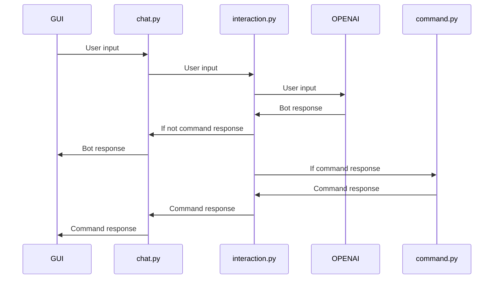

## Chat.py

```mermaid
sequenceDiagram
    participant GUI
    participant chat.py
    participant interaction.py
    participant OPENAI
    participant command.py
    GUI->>chat.py: User input
    chat.py->>interaction.py: User input
    interaction.py->>OPENAI: User input
    OPENAI->>interaction.py: Bot response
    interaction.py->>chat.py: If not command response
    chat.py->>GUI: Bot response
    interaction.py->>command.py: If command response
    command.py->>interaction.py: Command response
    interaction.py->>chat.py: Command response
    chat.py->>GUI: Command response
```