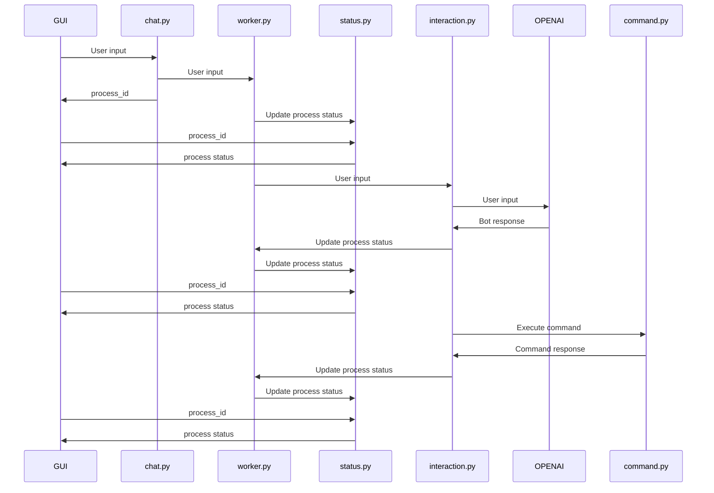

## Chat.py


# TODO
### chat.py response
```json	
    {
        "state":"correct",
        "process_id": "12312312"
    }
```

### routes/process
```json
    {
        "state": "completed",
        "process_id": "12312312",
        "response": "Son las 12:00"
    }
```
```json
    {
        "state": "pending",
        "process_id": "12312312",
        "preview": "Son las"
    }
```
```json
    {
        "state": "error",
        "process_id": "12312312",
        "preview": "Son las",
        "error": "No se pudo completar la solicitud"
    }
```

### sequence diagram for process_id

