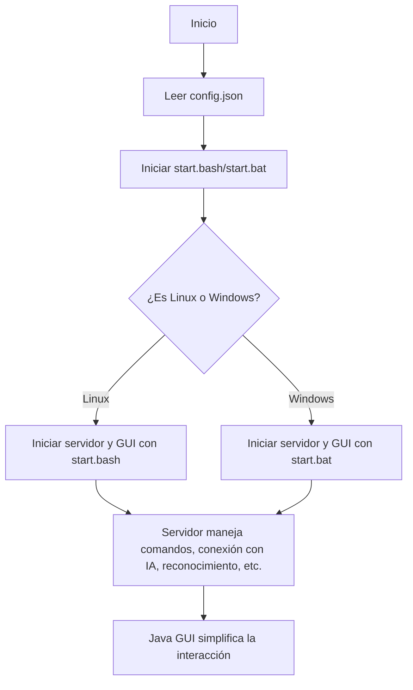
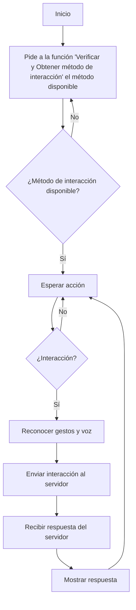
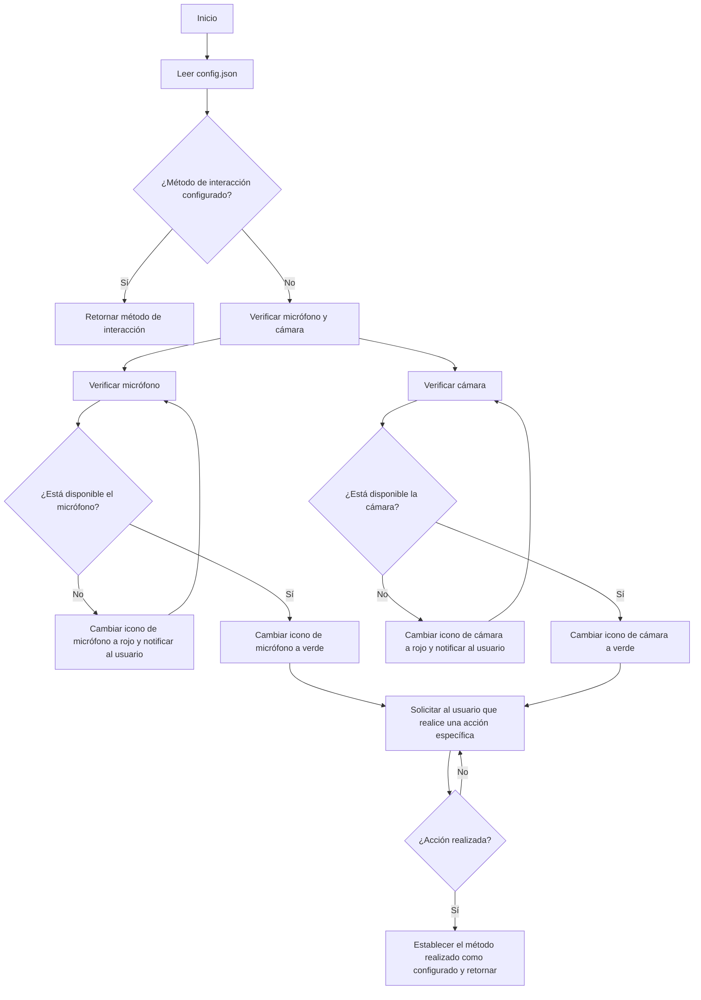

```mermaid
graph TD
    A[Inicio] --> B[Leer config.json]
    B --> C[Iniciar start.bash/start.bat]
    C --> D{¿Es Linux o Windows?}
    D -->|Linux| E[Iniciar servidor y GUI con start.bash]
    D -->|Windows| F[Iniciar servidor y GUI con start.bat]
    E --> G[Servidor maneja comandos, conexión con IA, reconocimiento, etc.]
    F --> G
    G --> H[Java GUI simplifica la interacción]
```

# GUI

```mermaid
graph TD
    A[Inicio]
    B[Pide a la función 'Verificar y Obtener método de interacción' el método disponible]
    C{¿Método de interacción disponible?}
    G[Esperar acción]
    H{¿Interacción?}
    I[Reconocer gestos y voz]
    K[Enviar interacción al servidor]
    L[Recibir respuesta del servidor]
    M[Mostrar respuesta]
    

    A --> B
    B --> C
    C -->|No| B
    C -->|Sí| G
    G --> H
    H -->|No| G
    H -->|Sí| I
    I --> K
    K --> L
    L --> M
    M --> G

```
### Verificar y Obtener metodo de interacción 
Retorna  el método de interacción disponible.

```mermaid
graph TD
    A[Inicio] --> B[Leer config.json]
    B --> C{¿Método de interacción configurado?}
    C -->|Sí| D[Retornar método de interacción]
    C -->|No| E[Verificar micrófono y cámara]
    E --> E_microfono_verificar[Verificar micrófono]
    E_microfono_verificar --> E_microfono_disponible{¿Está disponible el micrófono?}
    E_microfono_disponible -->|No| E_microfono_rojo[Cambiar icono de micrófono a rojo y notificar al usuario]
    E_microfono_rojo --> E_microfono_verificar
    E_microfono_disponible -->|Sí| E_microfono_verde[Cambiar icono de micrófono a verde]
    E --> E_camara_verificar[Verificar cámara]
    E_camara_verificar --> E_camara_disponible{¿Está disponible la cámara?}
    E_camara_disponible -->|No| E_camara_rojo[Cambiar icono de cámara a rojo y notificar al usuario]
    E_camara_rojo --> E_camara_verificar
    E_camara_disponible -->|Sí| E_camara_verde[Cambiar icono de cámara a verde]
    E_microfono_verde --> F[Solicitar al usuario que realice una acción específica]
    E_camara_verde --> F
    F --> G{¿Acción realizada?}
    G -->|Sí| H[Establecer el método realizado como configurado y retornar]
    G -->|No| F
```

