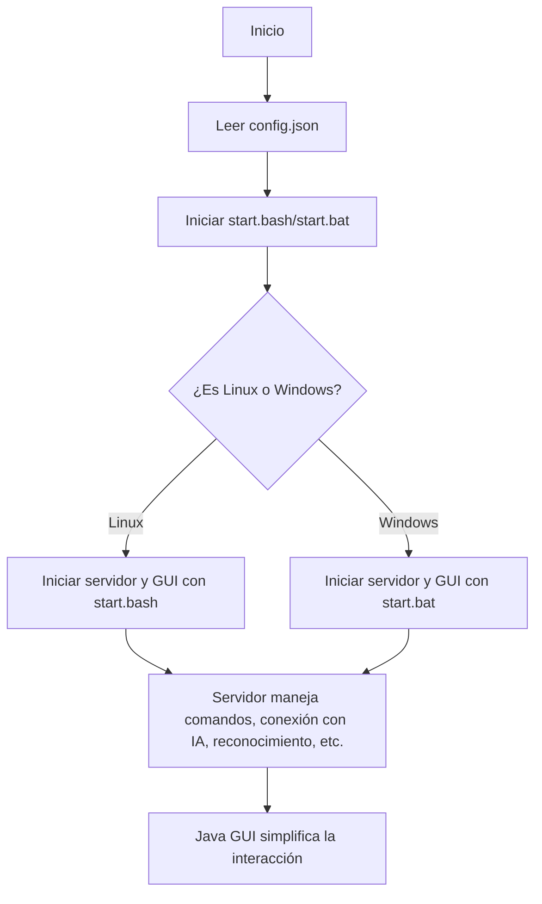
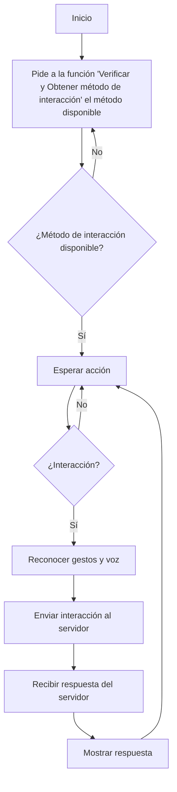
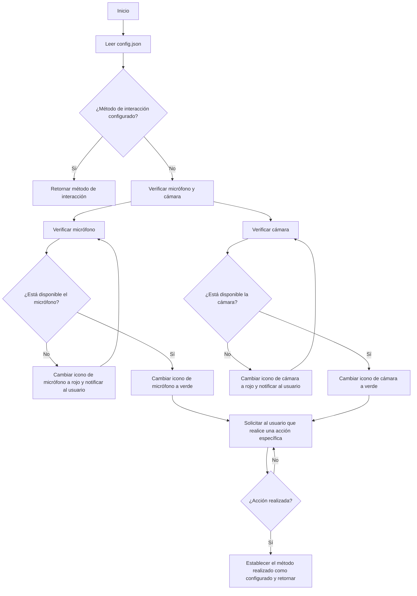
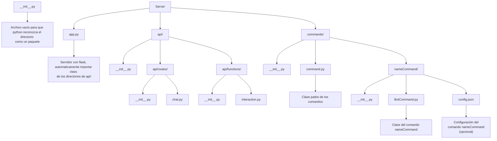
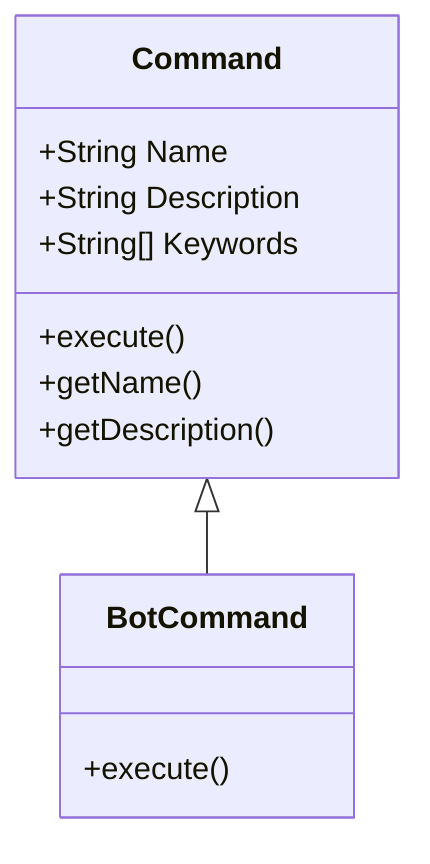

# GUI

### Verificar y Obtener metodo de interacción 
Retorna  el método de interacción disponible.


## Ordenamiento de la API


# Class


# Se envia un json a la api/chat.py con el siguiente formato
```json
{
    messages: [
        {
            "content": "Hola",
            "role": "assitant"
        },
        {
            "content": "Hola",
            "role": "user"
        }
    ]
    model: "gpt4o"
}
```
chat.py se encarga de procesar con ayuda de interaccion.py el contenido del json y devolver una respuesta
```json
{
    response: "Hola, ¿en qué puedo ayudarte?",
}
```

Interaction.py tiene que indentificar el metodo de interaccion, si usa funciones externas por ejemplo:

```python
tools = [
    {
        "type": "function",
        "function": {
            "name": "get_current_weather",
            "description": "Get the current weather",
            "parameters": {
                "type": "object",
                "properties": {
                    "location": {
                        "type": "string",
                        "description": "The city and state, e.g. San Francisco, CA",
                    },
                    "format": {
                        "type": "string",
                        "enum": ["celsius", "fahrenheit"],
                        "description": "The temperature unit to use. Infer this from the users location.",
                    },
                },
                "required": ["location", "format"],
            },
        }
    },
    {
        "type": "function",
        "function": {
            "name": "get_n_day_weather_forecast",
            "description": "Get an N-day weather forecast",
            "parameters": {
                "type": "object",
                "properties": {
                    "location": {
                        "type": "string",
                        "description": "The city and state, e.g. San Francisco, CA",
                    },
                    "format": {
                        "type": "string",
                        "enum": ["celsius", "fahrenheit"],
                        "description": "The temperature unit to use. Infer this from the users location.",
                    },
                    "num_days": {
                        "type": "integer",
                        "description": "The number of days to forecast",
                    }
                },
                "required": ["location", "format", "num_days"]
            },
        }
    },
]
```

```python
messages = []
messages.append({"role": "system", "content": "Don't make assumptions about what values to plug into functions. Ask for clarification if a user request is ambiguous."})
messages.append({"role": "user", "content": "What's the weather like today"})
chat_response = chat_completion_request(
    messages, tools=tools
)
assistant_message = chat_response.choices[0].message
messages.append(assistant_message)
assistant_message
```
Output:
```text
ChatCompletionMessage(content="I need to know your location to provide you with the current weather. Could you please specify the city and state (or country) you're in?", role='assistant', function_call=None, tool_calls=None)
```
 
```python	
messages.append({"role": "user", "content": "I'm in Glasgow, Scotland."})
chat_response = chat_completion_request(
    messages, tools=tools
)
assistant_message = chat_response.choices[0].message
messages.append(assistant_message)
assistant_message
```
Output:
```text
ChatCompletionMessage(content=None, role='assistant', function_call=None, tool_calls=[ChatCompletionMessageToolCall(id='call_Dn2RJJSxzDm49vlVTehseJ0k', function=Function(arguments='{"location":"Glasgow, Scotland","format":"celsius"}', name='get_current_weather'), type='function')])
```

Mas detalle en https://cookbook.openai.com/examples/how_to_call_functions_with_chat_models